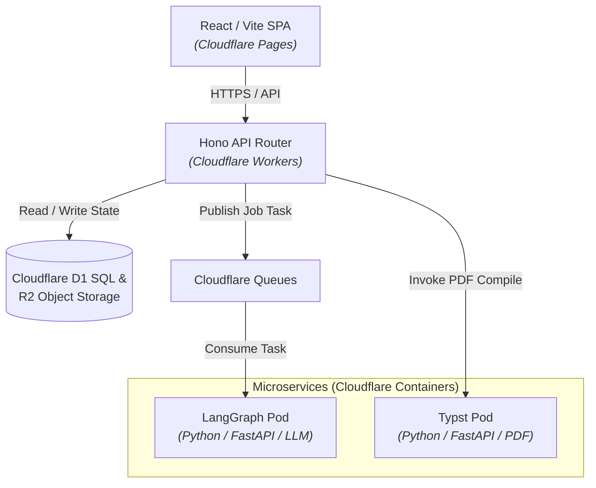
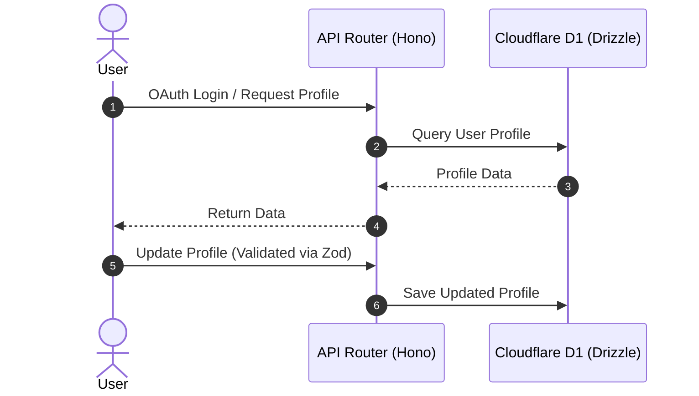
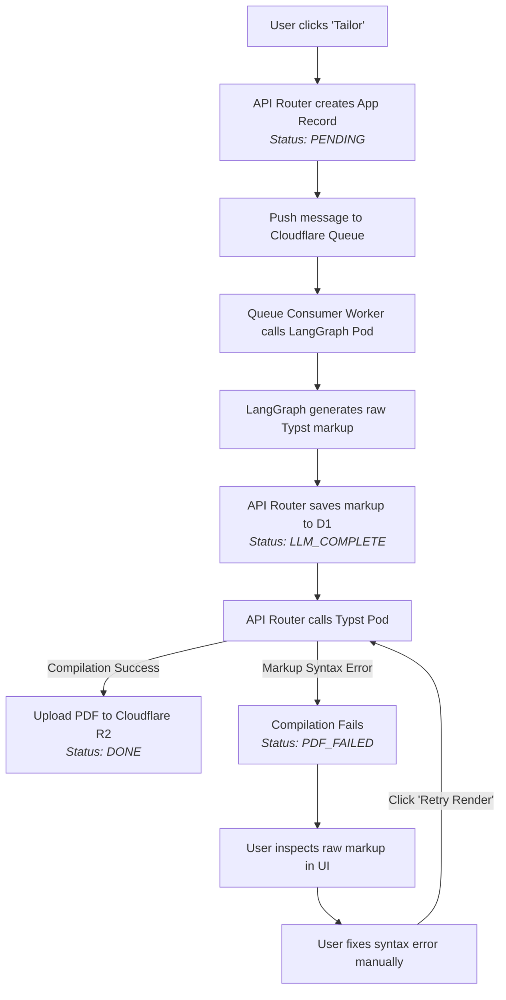

# 🚀 Jobbernaut

> **Career Intelligence Platform**  
> An edge-first, event-driven platform designed to automate resume tailoring, cover letter generation, and application document management.

---

## 📖 Overview

Jobbernaut is a cloud-native, event-driven platform that automates the most tedious parts of the job search: resume tailoring and document management. 

Originally built as a heavy enterprise microservice architecture, the system has been rescoped and optimized for high developer velocity, zero-maintenance infrastructure, and maximum portability. The entire ecosystem is deployed 100% on **Cloudflare**.

---

## 🏗️ Tech Stack

| Domain | Technology |
|---|---|
| **Frontend** | React + Vite (TypeScript) |
| **API Router** | Hono (TypeScript) |
| **Database** | Cloudflare D1 (Serverless SQLite) via Drizzle ORM |
| **Storage** | Cloudflare R2 (S3-Compatible Object Storage) |
| **Message Broker** | Cloudflare Queues |
| **AI Engine Pod** | Python + FastAPI + LangGraph |
| **PDF Engine Pod** | Python + FastAPI + Typst |
| **Infrastructure** | Cloudflare Pages, Workers, and Cloudflare Containers |

---

## 🧩 System Architecture

The architecture is strictly divided into **5 decoupled components** to ensure stability, ease of testing, fault tolerance, and zero-maintenance scaling.



### 1. Frontend (UI)

A Single Page Application (SPA) where users manage their Master Profile (skills, experience, education), paste job descriptions, and track application statuses.

* **Hosting:** Cloudflare Pages
* **State Management:** React Context / Zustand
* **Auth:** LinkedIn OAuth (orchestrated via API Router)

### 2. API Router (Control Plane)

A lightweight, high-speed API gateway that handles CRUD operations, authentication, and orchestrates the AI and PDF execution pods.

* **Hosting:** Cloudflare Workers
* **Framework:** Hono
* **Validation:** Zod (with shared TypeScript types for the frontend)

### 3. Database & Storage (State)

The system's source of truth. Acts as the resilience bridge between decoupled pods so that if a downstream process fails, the state is preserved and recoverable.

* **Database:** Cloudflare D1 (managed via Drizzle ORM). Stores User Profiles, Job Metadata, and Application State (`PENDING`, `LLM_COMPLETE`, `PDF_FAILED`, `DONE`).
* **Storage:** Cloudflare R2. Stores final compiled PDF resumes and cover letters.

### 4. LangGraph Pod (AI Engine)

A stateless Docker container responsible for LLM orchestration. It accepts the Master Profile and Job Description, runs a LangChain/LangGraph pipeline, and generates raw Typst markup.

* **Hosting:** Cloudflare Containers
* **Framework:** Python + FastAPI + LangGraph

### 5. Typst Pod (PDF Engine)

A stateless Docker container responsible for compiling raw Typst markup into a high-quality PDF. Decoupled from the AI engine to prevent costly LLM re-runs in the event of markup syntax errors.

* **Hosting:** Cloudflare Containers
* **Framework:** Python + FastAPI + Typst

---

## 🔄 Core Workflows

### Workflow A: Profile & Job Management (Synchronous)



1. User logs in via LinkedIn OAuth.
2. Frontend requests Master Profile data from the API Router.
3. API Router queries Cloudflare D1 via Drizzle ORM and returns the data.
4. User updates their profile; API Router validates via Zod and updates D1.

---

### Workflow B: The Generation Pipeline (Asynchronous & Resilient)

This workflow utilizes a state-machine pattern backed by Cloudflare D1 and Queues to guarantee fault tolerance.



1. **Initiation:** User pastes a Job Description and clicks **Tailor**.
2. **Routing:** API Router creates an Application record in D1 (`Status: PENDING`) and pushes a task message onto a Cloudflare Queue.
3. **AI Generation:**
* A Worker consumes the queue message and calls the **LangGraph Pod**.
* The pod generates the tailored resume formatted in raw Typst markup.
* The API Router saves this markup to D1 and updates status to `LLM_COMPLETE`.


4. **PDF Compilation:**
* The API Router invokes the **Typst Pod** with the raw markup.
* **Success:** The pod compiles the PDF, uploads it to Cloudflare R2, and returns the asset URL. Status updates to `DONE`.
* **Failure:** If the pod fails due to a markup syntax error, status updates to `PDF_FAILED`.


5. **Human-in-the-Loop Recovery:**
* If `PDF_FAILED` occurs, the user can inspect the raw markup directly in the UI, fix the syntax error manually, and click **Retry Render**.
* The API Router bypasses the AI Pod entirely and sends the corrected markup directly to the Typst Pod—saving operational time and LLM token costs.


---

## 🚀 Infrastructure & Deployment Philosophy

* **Zero Vendor Lock-in:** Standardizing on Docker containers for heavy processing and standard SQL/ORM patterns ensures the entire system can be migrated to AWS, GCP, or bare metal with minimal refactoring.
* **Scale to Zero:** The entire stack (Pages, Workers, D1, R2, Containers) scales down to zero when idle, resulting in near-zero hosting costs for low-traffic or self-hosted deployments.
* **Edge-First:** All routing, database queries, and static UI delivery occur at the Cloudflare edge to deliver instant global response times.

---

## 🛠️ Getting Started (Local Development)

### Prerequisites

* Node.js (v18+)
* Python 3.10+
* Docker & Docker Compose
* Wrangler CLI (`npm install -g wrangler`)

### Quick Setup

```bash
# 1. Clone the repository
git clone [https://github.com/your-username/jobbernaut.git](https://github.com/your-username/jobbernaut.git)
cd jobbernaut

# 2. Install dependencies for API & Frontend
npm install

# 3. Spin up local container pods (LangGraph & Typst)
docker-compose up -d

# 4. Start local development server with Wrangler
npm run dev

```

---

## 📄 License

© 2026 Snehashish Reddy Manda. All rights reserved.
